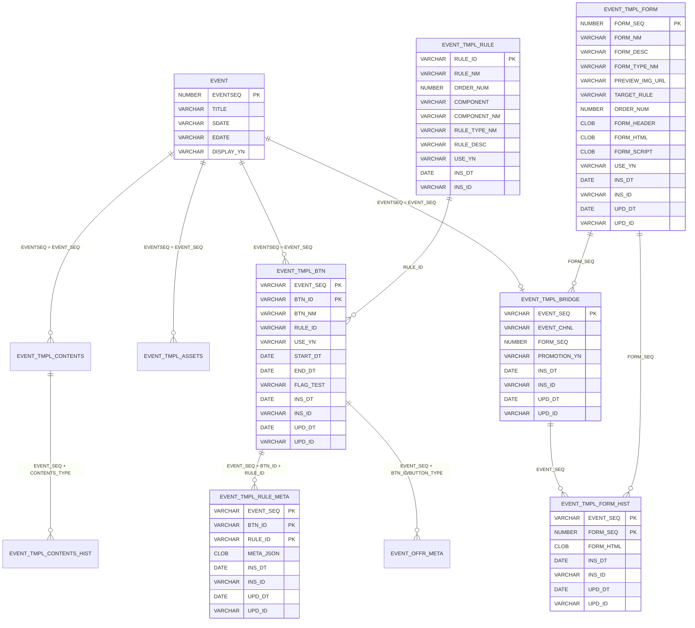

# 🧩 ERD · 개념 구조

> 기준: v10(20260706) 최종 ERD.

## 1. 개념 구조

```text
EVENT
 ├─ EVENT_TMPL_BTN
 │    ├─ EVENT_TMPL_RULE
 │    └─ EVENT_TMPL_RULE_META
 ├─ EVENT_TMPL_BRIDGE
 │    └─ EVENT_TMPL_FORM
 │         └─ EVENT_TMPL_FORM_HIST
 ├─ EVENT_TMPL_CONTENTS
 │    └─ EVENT_TMPL_CONTENTS_HIST
 └─ EVENT_TMPL_ASSETS
```

**2개의 독립 축**
| 축 | 테이블 | 담당 |
|----|--------|------|
| **실행 축** | `BTN` → `RULE` → `RULE_META` | 기능(무엇이 실행되나) |
| **화면 축** | `BRIDGE` → `FORM` → `FORM_HIST` | 구성(무엇이 보이나) |
| 부속 | `CONTENTS`(+HIST) · `ASSETS` | 마크업·리소스 |

> 💡 두 축이 **표준 class(`ha-btn-{slotNo}-{role}`)로 런타임에 결합**된다. → [21](./21-class-binding-spec.md)

## 2. ERD (mermaid)



> ⚠️ **`EVENT` ↔ `EVENT_TMPL_*` 는 물리 FK가 없다** (`EVENTSEQ` NUMBER vs `EVENT_SEQ` VARCHAR2). ERD의 관계선은 **논리 관계** 표현이다.
> ⚠️ `EVENT ||--o| EVENT_TMPL_BRIDGE` — **1:0..1** (이벤트당 프로모션폼 1개). 채널별 복수 폼은 미지원 → [71](./71-risks-followups.md)

## 3. 실행 축 — Rule 실행 흐름

```text
이벤트 진입
→ EVENT_SEQ 기준 버튼 목록 조회
→ BTN_ID / RULE_ID 확인
→ EVENT_TMPL_RULE 조회
→ EVENT_TMPL_RULE_META.META_JSON 조회
→ Rule Handler 실행
→ 결과 메시지 반환
→ 필요 시 리워드 / 응모 / 클릭 적재 처리
```

## 4. 화면 축 — 프로모션폼 선택 흐름

```text
프로모션폼 선택 페이지
→ EVENT_TMPL_FORM 목록 조회
→ PREVIEW_IMG_URL 로 카드 이미지 표시
→ FORM_TYPE_NM 으로 리스트 뱃지 표시
→ FORM_NM / FORM_DESC 표시
→ 선택 시 EVENT_TMPL_BRIDGE 에 EVENT_SEQ + FORM_SEQ 연결
→ PROMOTION_YN 으로 사용 여부 관리
```

## 5. 캐시 경계
- Rule Meta 는 **`EVENT_SEQ + BTN_ID + RULE_ID`** 키로 런타임 캐시(약 3분) → [33](./33-meta-json-spec.md)
- BO 저장·반영 시 **flush 고려** 필요

## 참고
- [상위 허브](../ARCHIVE-event-template.md) · [번들 인덱스](./00-INDEX.md)
- [30-ddl-event-tmpl.md](./30-ddl-event-tmpl.md) · [34-operational-sql.md](./34-operational-sql.md)
